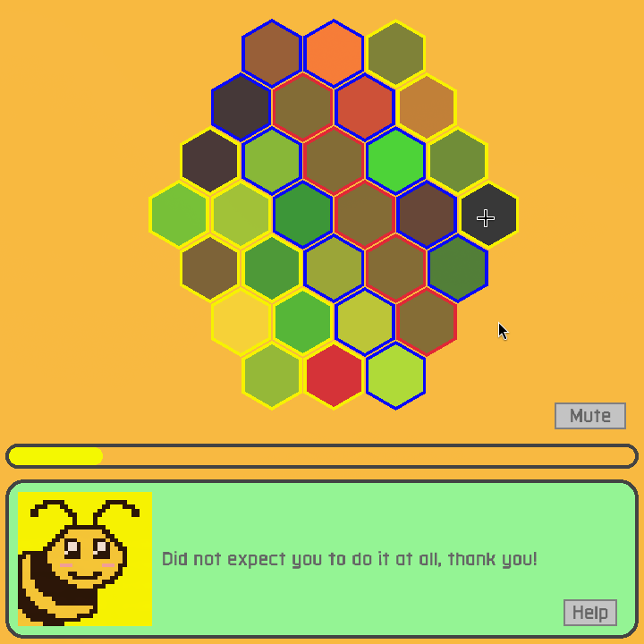
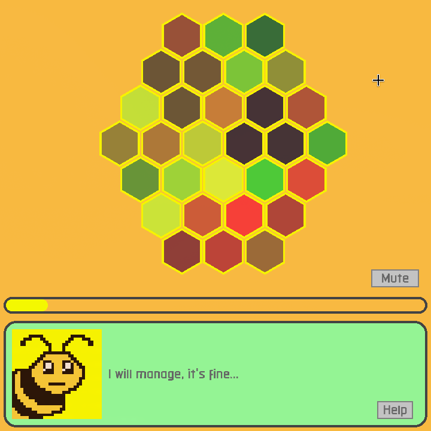

# Meebee's Honeycomb
<table>
  <th>
    
  </th>
  <th>
    
  </th>
</table>

Merge honeycomb cells to help Meebee repair the witch curse! Do it enough times to gain her trust!

Created with [Raylib](https://www.raylib.com/)  
Background music made with [JummBox](https://jummb.us/)  
Sound effects made with [rFXGen](https://raylibtech.itch.io/rfxgen)  
Assets created with [Aseprite](https://www.aseprite.org/)  
Font source: [Militech (by Adam Rucki)](https://www.dafont.com/militech.font)

